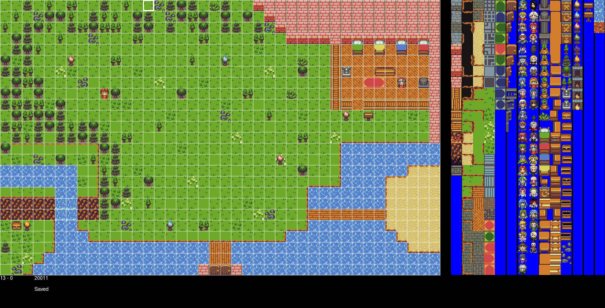

#  TILE_GAME - LUA 

## install LOVE
- WINDOWS:
 Installation isn't required, LOVE is in love2d folder of repository.
- LINUX:
```shell
  $ sudo add-apt-repository ppa:bartbes/love-stable
  $ sudo apt-get update
  $ sudo apt-get install love
 ```
## run
- WINDOWS:
  run run_win.bat
- LINUX:
  if love2d is installed, run run_linx.sh

## game
- press i key to see inventory
- press q key to acion with another things (npc, cartel, doors...)

# SCREEN


# MAP_EDITOR - PYTHON
This simply program allow you to create or change all game map. All game map saved in maps folder. If you give this program a name of a exists map, the program allow you to change this. Else the program create a new map with this new name. [pygame is required]
## run
in map_editor folder there is main.py.
WINDOWS: use run_win.bat in map_editor folder for give name of map to create/change
LINUX: type `python main.py` in map_editor folder to see help of argparse

