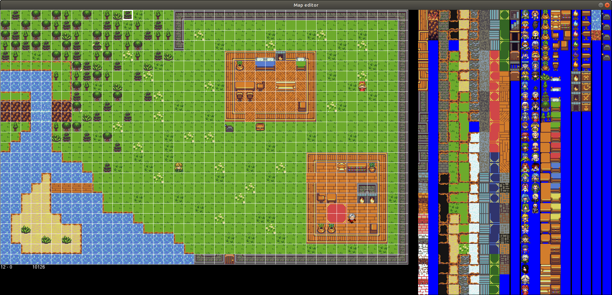
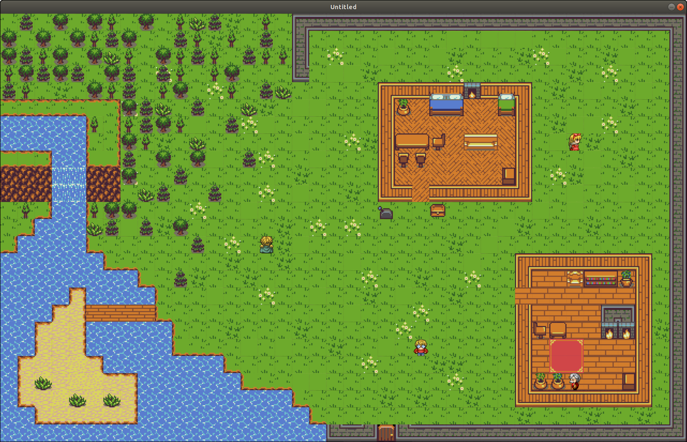

# TileGame-Lua

### Credits
Ogni partecipante, sia per aver scritto la storia, creato o modificato mappe, composto o suonato le colonne sonore, o creato e modificato immagini.

## Tools
### MAP EDITOR
##### Dipendenze:
 - Python 2 / Python 3 (Consigliabile Python3)
 - Pygame
 - Tkinter

##### Utilizzo:
  - LINUX:
    - Modificare: `python map_editor/main.py [<name_map>]`
    - Creare: `python map_editor/main.py [<name_map>]`
    - Eliminare: `python map_editor/main.py del [<name_map>]`
  - WINDOWS:
    - Modificare: avviare `map_editor/edit.bat`
    - Creare: avviare `map_editor/new.bat`
    - Eliminare: avviare `map_editor/del.bat`

##### Anteprima:

##### Istruzioni:
  - **Mappa**

    Cliccando sulla mappa aggiungiamo l'item attuale che abbiamo selezionato alla posizione che abbiamo cliccato.
  - **Barra selezione**

  Contiene tutti gli item che possiamo inserire: in seguito possiamo aggiungerli alla **Mappa**.
  - **Impostazioni aggiuntive**

  Quando inseriamo delle porte, degli npc, delle leve, o dei cartelli, ci si aprirà una piccola finestra dove inserire le **impostazioni aggiuntive**: non preoccupatevi se non riconoscete alcune voci... Se chiudete la finestra l'aggiunta verrà annullata.

##### Comandi:
  - **Save:** premento il tasto **s** la mappa viene salvata e quindi la versione precedente viene sovrascritta;

### Screenshoots

