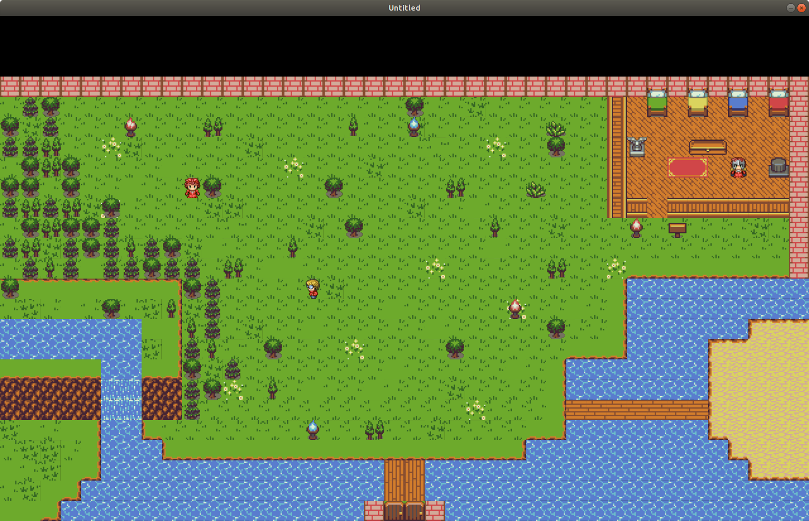

# TileGame-Lua

### Credits
Ogni partecipante, sia per aver scritto la storia, creato o modificato mappe o creato e modificato immagini.

## Tools
### MAP EDITOR
##### Dipendenze:
 - Python 2 / Python 3 (Consigliabile Python3)
 - Pygame

##### Utilizzo:
  - LINUX:
    - Modificare: `python map_editor/main.py [<name_map>]`
    - Creare: `python map_editor/main.py [<name_map>]`
    - Eliminare: `python map_editor/main.py del [<name_map>]`
  - WINDOWS:
    - Modificare: avviare `map_editor/edit.bat`
    - Creare: avviare `map_editor/new.bat`
    - Eliminare: avviare `map_editor/del.bat`

##### Anteprima:

##### Istruzioni:
  - **Mappa:**
    Cliccando sulla mappa aggiungiamo l'item attuale che abbiamo selezionato alla posizione che abiamo cliccato;
  - **Barra aggiunta:**
    Selezionando gli item di questa barra possiamo aggiungerli alla **Barra selezione**;
  - **Barra selezione:** Contiene tutti gli item che possiamo inserire, cliccandoci sopra lo selezionamo: in seguito possiamo aggiungerli alla **Mappa**;

##### Comandi:
  - **Save:** premento il tasto **s** la mappa viene salvata e quindi la versione precedente viene sovrascritta;
  - **Info:** premento il tasto **i** il programma

### IMAGE EDITOR
### STORY EDITOR

### Screenshoots

