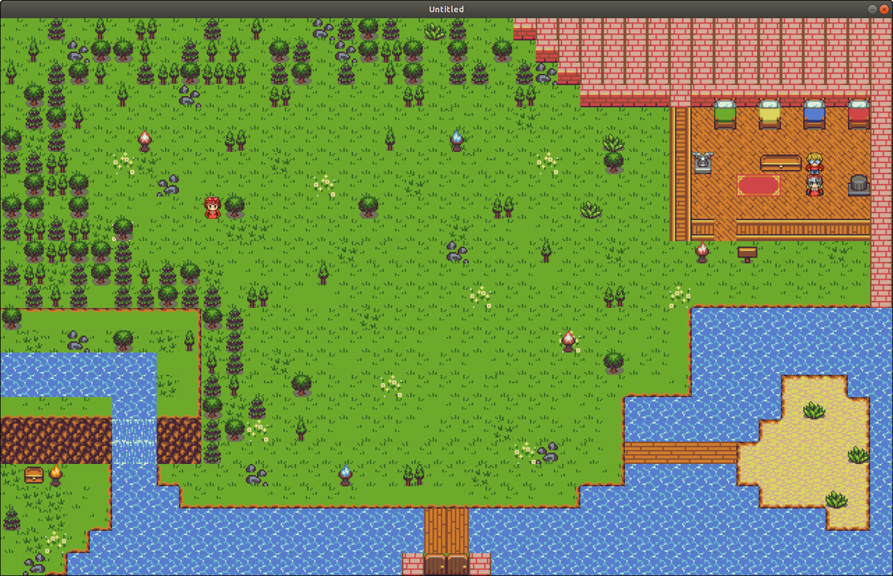
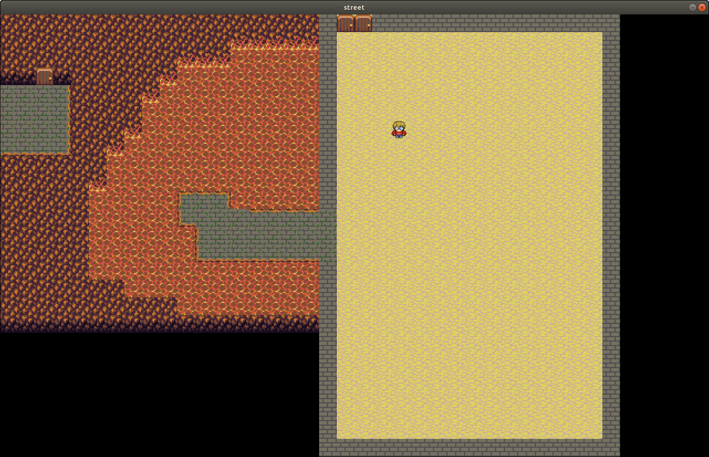

# Release 0.0.1

- **2/05/2018**
- **Paoli Tommaso**
- **Release 0.0.1**

Come prima versione in beta non ci aspettiamo fin troppe cose dal nostro programma. L'utente all'avvio avrà a disposizione le prime due mappe create dove è libero di muoversi senza incappare in alcun errore di gioco. Il personaggio principale, manovrato con le freccie dall'utente ha la possibilità di parlare con gli npc e leggere le scritte su cartelli e porte. L'utente potrà visualizzare una prima versione di "inventario" premendo il pulsante **i** che attualmente mostrerà solo le principali statistiche del personaggio, non avendo potuto raccogliere o comparare items. I tools **map_editor** e **tilesheet_editor** sono ancora in via di sviluppo quindi non hanno una completa affidabilità.

Chiediamo gentilmente a chiunque "testi" questa versione di segnalare qualsiasi anomalia o qualsiasi errore prodotto dal programma tramite **issue** o tramite mail all'indirizzo <paoli7612@gmail.com>

### Screenhoots

### Collaborators

<table>
  <tr><td rowspan="3">
      </img>
    </td><td>**paoli7612**</td></tr>
  <tr><td>https://github.com/paoli7612</td></tr>
  <tr><td>Capo progetto</td></tr>
</table>
<table>
  <tr><td rowspan="3">
      </img>
    </td><td>**federico-brian**</td></tr>
  <tr><td>https://github.com/federico-brian</td></tr>
  <tr><td>Collaboratore</td></tr>
</table>
<table>
  <tr><td rowspan="3">
      </img>
    </td>
    <td>**xdaku**</td></tr>
  <tr><td>https://github.com/xdaku</td></tr>
  <tr><td>Collaboratore</td></tr>
</table>
